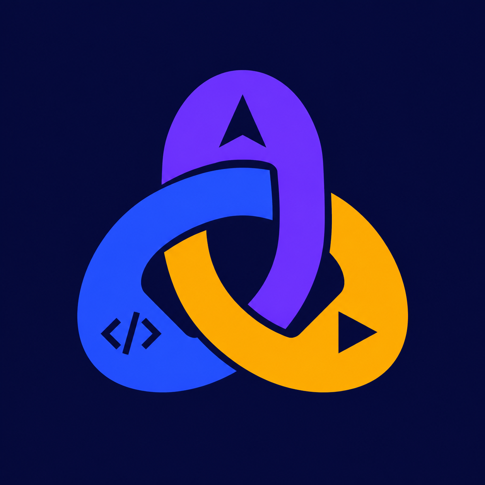
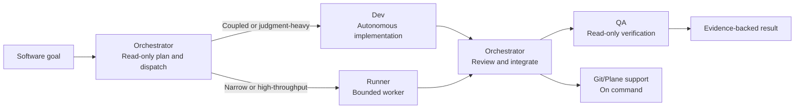

<div align="center">
  
  <h1>Polyloom</h1>
  <p><strong>One orchestrator. Six purposeful roles. Evidence before done.</strong></p>
  <p>A portable project-local software-development team for Codex and Claude.</p>
  <p>
    <a href="https://github.com/xkritti/polyloom/actions/workflows/validate.yml"></a>
    <a href="./LICENSE"></a>
  </p>
  <p><a href="#why-polyloom">Why Polyloom</a> · <a href="#quick-start">Quick start</a> · <a href="#how-it-works">How it works</a> · <a href="#safety-model">Safety</a></p>
</div>

> [!NOTE]
> Polyloom is an open-source community project. It is not an official OpenAI project.

## Why Polyloom

Polyloom keeps ownership clear: the read-only orchestrator coordinates the
whole outcome while routing implementation to an autonomous dev, bounded work
to runner, and verification to independent QA.

| Orchestrator coordinates | Dev builds | Runner accelerates | QA verifies |
| --- | --- | --- | --- |
| Plans, assigns, integrates, reviews, and delivers; never writes repository files | Handles coupled, ambiguous, multi-file, and judgment-heavy implementation end to end | Handles detailed, narrow, mechanical, and high-throughput assignments | Independently verifies code and regressions in read-only mode |

- **One accountable orchestrator:** The orchestrator stays on the critical path from plan to final evidence and is the only agent that assigns core work; users dispatch Git/Plane support directly only for explicit lifecycle actions.
- **Purposeful routing:** Dev handles coupled work autonomously; Runner handles bounded work without delegation.
- **Safe parallelism:** Workers run together only with explicit, disjoint ownership.
- **Complexity-aware dev parallelism:** The orchestrator may spawn 3-7 dev agents when materially useful; shared-state work stays sequential.
- **Verification built in:** Worker summaries are not proof; QA and the orchestrator review evidence.
- **No surprise publishing:** Deployment, production mutation, commits, pushes, and pull requests require user authorization.

## Quick start

### Requirements

- A Codex runtime and account.
- Python 3.9 or newer for installation.
- Python 3.11 or newer for repository validation.

### 1. Install

```bash
git clone https://github.com/xkritti/polyloom.git polyloom-kit
python3 polyloom-kit/scripts/install.py --scope project --runtime both --project-root /path/to/your-project
```

Run the installer from the kit checkout and point `--project-root` at the
application project. Project mode writes only `.agents/`, `.claude/`,
`.codex/`, and the ownership manifest `.polyloom-install.json` in that target;
it never writes global homes. Remove unchanged owned files safely with
`python3 polyloom-kit/scripts/install.py --scope project --project-root /path/to/your-project --uninstall`.
Use `--scope user --runtime codex` or `--scope user --runtime zcode` only for
legacy compatibility installations.

The legacy Codex user-scope installer copies the skill and compatibility role
definitions into `$CODEX_HOME`, or `~/.codex` when `CODEX_HOME` is unset. It
preserves existing Codex files by refusing to overwrite them unless `--force`
is supplied. The ZCode installer refreshes its plugin cache and updates its
local registration. `scripts/install.py` handles files and registration only;
`scripts/setup.py` optionally persists Codex model/effort and ZCode team
settings when values are supplied through flags or interactive setup.

Project-scoped Codex installs include exactly six native custom agents
(`orchestrator`, `dev`, `runner`, `qa`, `git-manager`, and `plane-manager`) with
this fixed matrix:

| Role | Model | Effort | Sandbox |
| --- | --- | --- | --- |
| orchestrator | `gpt-5.6-sol` | `medium` | `read-only` |
| dev | `gpt-5.6-luna` | `max` | default |
| runner | `gpt-5.6-luna` | `max` | default |
| qa | `gpt-5.6-terra` | `medium` | `read-only` |
| git-manager | `gpt-5.6-luna` | `medium` | default |
| plane-manager | `gpt-5.6-luna` | `medium` | default |

Claude adapters keep their own runtime-native model configuration and never
pin an OpenAI model. Legacy ZCode user-scope files remain compatibility-only.

### 2. Configure

Merge the relevant examples instead of replacing existing configuration:

- [`examples/config.toml`](./examples/config.toml) → `~/.codex/config.toml`
- [`examples/AGENTS.md`](./examples/AGENTS.md) → `~/.codex/AGENTS.md`

These are configuration snippets; copying or merging them is a separate manual
step. Restart Codex or open a new task after changing them.

### 3. Start a team task

Invoke the skill explicitly:

```text
$polyloom

Goal: implement the feature and verify it end to end.
```

With the example global policy installed, software-development prompts starting
with `Goal:` or `/goal`, plus requests such as `use software team`, can load
Polyloom automatically.

## How it works



The orchestrator owns orchestration throughout. Every role receives a
concrete goal, exact ownership (files/modules), constraints, acceptance
criteria, validation commands, expected evidence, and dependency/order. Roles
may run in parallel only when write scopes are disjoint. Dev never delegates;
blocked work returns to the same scope owner.

## What's included

| Path | Purpose |
| --- | --- |
| [`skills/polyloom/`](./skills/polyloom/) | Codex skill and UI metadata |
| [`agents/orchestrator.toml`](./agents/orchestrator.toml) | User-scope Codex orchestrator adapter |
| [`agents/dev.toml`](./agents/dev.toml) | User-scope Codex autonomous dev adapter |
| [`agents/runner.toml`](./agents/runner.toml) | User-scope Codex bounded runner adapter |
| [`agents/qa.toml`](./agents/qa.toml) | User-scope Codex read-only QA adapter |
| [`agents/git-manager.toml`](./agents/git-manager.toml) | User-scope Codex Git support adapter |
| [`agents/plane-manager.toml`](./agents/plane-manager.toml) | User-scope Codex Plane support adapter |
| [`examples/config.toml`](./examples/config.toml) | Parent runtime and concurrency example |
| [`examples/AGENTS.md`](./examples/AGENTS.md) | Minimal global routing policy |
| [`.agents/`](./.agents/) | Project-local six-role contracts |
| [`.claude/`](./.claude/) | Claude project adapter |
| [`.codex/`](./.codex/) | Codex project adapter |
| [`scripts/install.py`](./scripts/install.py) | Dependency-free installer |
| [`scripts/validate.py`](./scripts/validate.py) | Standard-library repository validator |

The old `lead`, `builder`, and `runner-worker` files remain only for legacy
ZCode compatibility and are not copied by the Codex user-scope installer.

## Safety model

- The skill cannot change the active parent model by itself.
- The orchestrator coordinates; only it can assign or spawn core roles. Users dispatch Git/Plane support directly only for explicit lifecycle actions.
- Dev is autonomous and cannot delegate; Runner and QA cannot delegate or spawn.
- Writing agents must preserve unrelated changes and stay inside assigned ownership.
- High-risk paths stay on the dev/orchestrator route and should receive independent security review.
- The skill does not authorize deployment, production mutation, pushing, merging, or pull-request creation.

## Validate

```bash
python3 scripts/validate.py
```

The validator checks skill metadata, role definitions, and example configuration.

## Contributing

Ideas, issues, and focused pull requests are welcome. Keep routing rules concise,
update examples when behavior changes, and run the validator before submitting a
change.

- Track work in the project's Plane workflow or pull requests; GitHub Issues are not used.
- [View the skill source](./skills/polyloom/SKILL.md)

## License

Polyloom is available under the [MIT License](./LICENSE).
