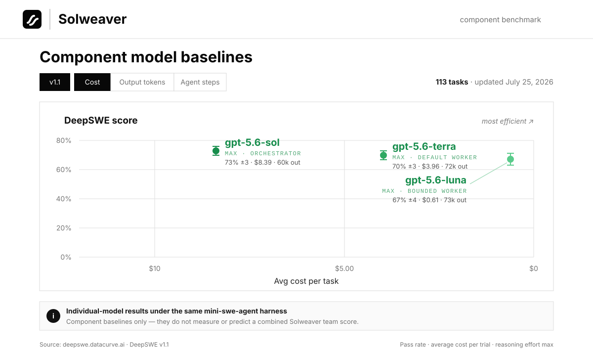
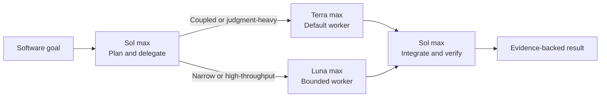

<div align="center">
  
  <h1>Solweaver</h1>
  <p><strong>One orchestrator. Two purpose-built workers. Evidence before done.</strong></p>
  <p>A practical multi-agent software team for Codex, led by GPT-5.6 Sol with GPT-5.6 Terra and GPT-5.6 Luna as bounded implementation workers.</p>
  <p>
    <a href="https://github.com/jay7793/solweaver/actions/workflows/validate.yml"></a>
    <a href="./LICENSE"></a>
    
    
  </p>
  <p>
    <a href="#why-solweaver">Why Solweaver</a> ·
    <a href="#quick-start">Quick start</a> ·
    <a href="#how-it-works">How it works</a> ·
    <a href="#benchmark-context">Benchmarks</a> ·
    <a href="#safety-model">Safety</a>
  </p>
</div>

> [!NOTE]
> Solweaver is an open-source community project. It is not an official OpenAI project.

## Why Solweaver

Multi-agent workflows are useful only when ownership stays clear. Solweaver
keeps one agent accountable for the whole outcome while routing bounded work to
the model that fits it best.

| Sol leads | Terra builds | Luna accelerates |
| --- | --- | --- |
| Plans, delegates, integrates, reviews, and delivers | Handles coupled, ambiguous, multi-file, and judgment-heavy implementation | Handles narrow, mechanical, repetitive, and high-throughput assignments |

- **One accountable lead:** Sol remains on the critical path from plan to final
  evidence.
- **Purposeful routing:** Terra is the default worker; Luna is selected when the
  work is bounded and low-coupling.
- **Safe parallelism:** workers run together only when their ownership is
  explicit and their write scopes are disjoint.
- **Verification built in:** worker summaries are not treated as proof; Sol
  reviews the changes and runs appropriate checks.
- **No surprise publishing:** deployment, production mutation, commits, pushes,
  and pull requests still require user authorization.

## Benchmark context



These are published **individual-model baselines** from the
[DeepSWE v1.1 leaderboard](https://deepswe.datacurve.ai/). Every model was
evaluated under the same `mini-swe-agent` harness.

> [!IMPORTANT]
> The chart is not a score for `Sol + Terra`, `Sol + Luna`, or Solweaver as a
> team. A valid team benchmark must run each complete configuration on the same
> tasks, limits, environment, and verifiers. Individual scores must not be
> added or averaged into a team result.

<details>
  <summary><strong>View the official DeepSWE leaderboard snapshot</strong></summary>
  <br>
  <a href="https://deepswe.datacurve.ai/">
    
  </a>
  <p><em>DeepSWE v1.1 cost view: 113 tasks, updated July 25, 2026. Screenshot © Datacurve and reproduced here for reference. Click the image for the live leaderboard.</em></p>
</details>

## Quick start

### Requirements

- A Codex runtime and account with access to `gpt-5.6-sol`,
  `gpt-5.6-terra`, and `gpt-5.6-luna`
- Python 3.9 or newer for installation
- Python 3.11 or newer for repository validation

The included configuration uses reasoning effort `max`, prioritizing capability
over token usage.

### 1. Install

```bash
git clone https://github.com/jay7793/solweaver.git
cd solweaver
python3 scripts/install.py
```

The installer copies the skill and worker definitions into `$CODEX_HOME`, or
`~/.codex` when `CODEX_HOME` is unset. It refuses to overwrite existing files.

### 2. Configure

Merge the relevant settings instead of replacing your existing configuration:

- [`examples/config.toml`](./examples/config.toml) → `~/.codex/config.toml`
- [`examples/AGENTS.md`](./examples/AGENTS.md) → `~/.codex/AGENTS.md`

Restart Codex or open a new task so the skill, agents, model, and reasoning
settings are reloaded.

### 3. Start a team task

Invoke the skill explicitly:

```text
$solweaver

Goal: implement the feature and verify it end to end.
```

With the example global policy installed, software-development prompts starting
with `Goal:` or `/goal`, plus requests such as `use software team`, can load
Solweaver automatically.

## How it works



| Role | Runtime | Best fit |
| --- | --- | --- |
| Orchestrator | `gpt-5.6-sol` / `max` | Planning, decomposition, ownership, integration, review, and delivery |
| Default worker | `gpt-5.6-terra` / `max` | Coupled, ambiguous, multi-file, architecture-sensitive, backend, frontend, database, integration, debugging, and refactoring work |
| Bounded worker | `gpt-5.6-luna` / `max` | Narrow, mechanical, repetitive, documentation-adjacent, high-throughput, or independent file clusters |

Sol owns orchestration throughout. Workers receive a concrete goal, explicit
file or module ownership, acceptance criteria, validation commands, and an
expected evidence format. Terra and Luna may run in parallel only when their
write scopes are disjoint.

## What's included

| Path | Purpose |
| --- | --- |
| [`skills/solweaver/`](./skills/solweaver/) | Codex skill and UI metadata |
| [`agents/terra-worker.toml`](./agents/terra-worker.toml) | Terra worker definition at `max` |
| [`agents/luna-worker.toml`](./agents/luna-worker.toml) | Luna worker definition at `max` |
| [`examples/config.toml`](./examples/config.toml) | Parent runtime and concurrency example |
| [`examples/AGENTS.md`](./examples/AGENTS.md) | Minimal global routing policy |
| [`scripts/install.py`](./scripts/install.py) | Dependency-free, no-overwrite installer |
| [`scripts/validate.py`](./scripts/validate.py) | Standard-library repository validator used by CI |

## Safety model

- The skill cannot change the active parent model by itself.
- Orchestration stays with Sol; a worker cannot silently take over the team.
- Writing agents must preserve unrelated changes and stay inside their assigned
  ownership.
- High-risk auth, money, tenant-isolation, data-integrity, concurrency, and
  production paths stay on the Terra/parent route and should receive an
  independent security review.
- The skill does not authorize deployment, production mutation, pushing,
  merging, or pull-request creation.

## Validate

Run the same check used by CI:

```bash
python3 scripts/validate.py
```

It validates skill frontmatter, folder and name consistency, UI metadata,
worker TOML definitions, model assignments, reasoning effort, and the example
configuration.

## Contributing

Ideas, issues, and focused pull requests are welcome. Please keep routing rules
concise, update examples when behavior changes, and run the validator before
submitting a change.

- [Open an issue](https://github.com/jay7793/solweaver/issues)
- [View the skill source](./skills/solweaver/SKILL.md)

## License

Solweaver is available under the [MIT License](./LICENSE).
